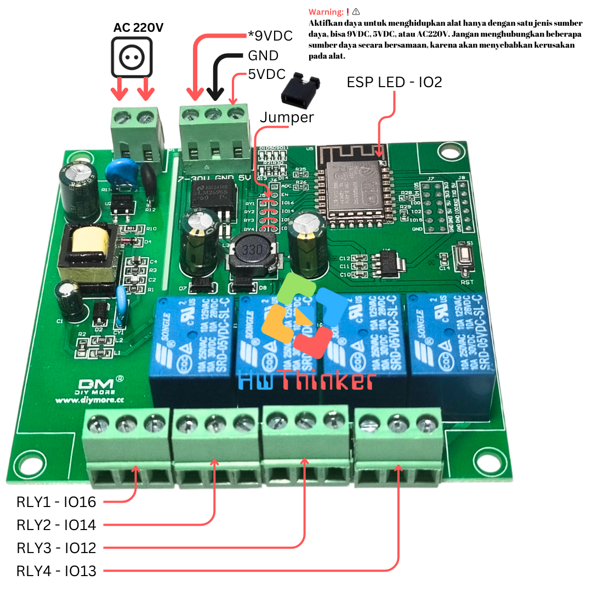
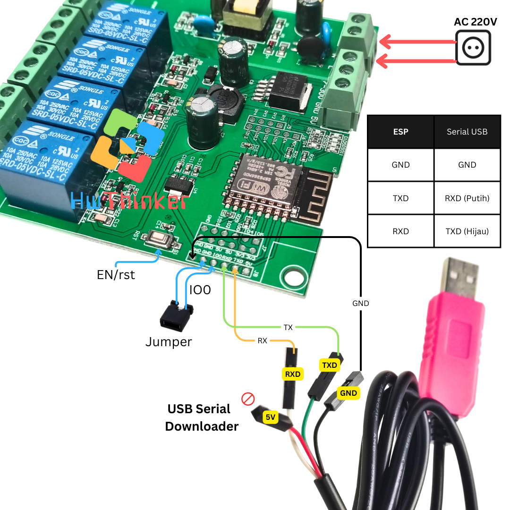
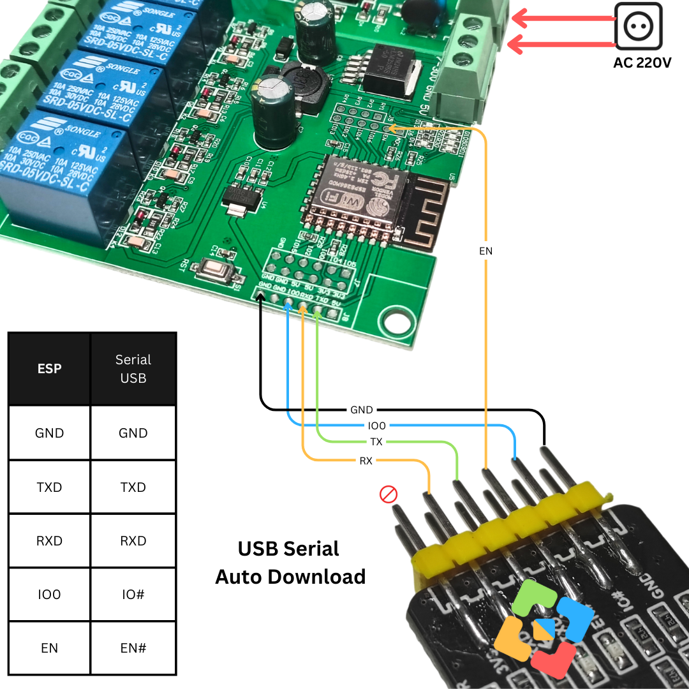

# Modul ESP8266 ESP-12f Relay 4 Channel 



## Cara download dengan Serial USB biasa


- Pasang serial USB TTL dengan ketentuan: 
   - TX Board-> RX USB Serial (Kabel Putih)
   - RX Board-> TX USB Serial (Kabel Hijau)
   - GND Board-> GND USB Serial (Kabel Hitam)
- Pastikan supply AC220V  dihubungkan 2 pin Terminal block(pin N dan L)
- jumper IO0 ke ground 
- klik (tekan dan lepas) tombol rst dan pastikan  IO0 masih di ground
- Lepas tombol IO0
- Download program dan tunggu sampai selesai
- klik tombol rst untuk run-program (langkah ini penting agar firmware baru dijalankan)
- ulang langkah awal bila melakukan download ulang lagi


## Cara download dengan Serial USB auto Download


- Pasang serial USB TTL dengan ketentuan:
    - RX board -> RX USB Serial  
    - TX board-> TX USB Serial 
    - GND board -> GND USB Serial  
    - IO0 board -> IO# USB Serial 
    - EN board -> EN# USB Serial
- Pastikan supply AC220V  dihubungkan 2 pin Terminal block(pin N dan L)
- Download program dan tunggu sampai selesai

Warning:❗⚠️
Aktifkan daya untuk menghidupkan alat hanya dengan satu jenis sumber daya, bisa 9VDC, 5VDC, atau AC220V. Jangan menghubungkan beberapa sumber daya secara bersamaan, karena akan menyebabkan kerusakan pada alat.


### Persiapan di Arduino

1. **Instal Arduino IDE**: Jika belum menginstal, unduh dan instal Arduino IDE dari website resmi Arduino.

2. **Tambahkan Board ESP8266 ke Arduino IDE**:

   - Buka **Arduino IDE**.

   - Pergi ke menu **File** → **Preferences**.

   - Di bagian 

     Additional Board Manager URLs

     , masukkan URL berikut:

     ```bash
     http://arduino.esp8266.com/stable/package_esp8266com_index.json
     ```

   - Klik **OK**.

   - Buka menu **Tools** → **Board** → **Boards Manager**.

   - Cari **ESP8266** dan instal paket yang ditampilkan.

3. **Pilih Board ESP8266**:

   - Pergi ke menu **Tools** → **Board**, lalu pilih board yang sesuai, seperti **NodeMCU 1.0 (ESP-12E Module)** atau board ESP8266 yang Anda gunakan.

4. **Pilih Port yang Tepat**:

   - Sambungkan ESP8266 ke komputer menggunakan kabel USB.
   - Pergi ke menu **Tools** → **Port** dan pilih port yang sesuai dengan ESP8266 Anda.


### Testing Relay

1. **Buat Sketsa Baru**:

   - Buka Arduino IDE, klik **File** → **New** untuk membuat sketsa baru.

2. Ketik Kode 

   ```c++
   #include <Arduino.h>
   
   #define LED_ESP 2
   #define RLY1 16
   #define RLY2 14
   #define RLY3 12
   #define RLY4 13
   
   const int relayPins[] = {RLY1, RLY2, RLY3, RLY4};
   const int numRelays = sizeof(relayPins) / sizeof(relayPins[0]);
   const int delayTime = 1000;  // Waktu delay dalam milidetik
   
   void setup() {
     pinMode(LED_ESP, OUTPUT);
     for (int i = 0; i < numRelays; i++) {
       pinMode(relayPins[i], OUTPUT);
       digitalWrite(relayPins[i], LOW);  // Matikan semua relay pada awal
     }
     digitalWrite(LED_ESP, LOW);  // Matikan LED pada awal
   }
   
   void loop() {
     digitalWrite(LED_ESP, HIGH);  // Nyalakan LED saat RLY1 aktif
     for (int i = 0; i < numRelays; i++) {
       digitalWrite(relayPins[i], HIGH);  // Nyalakan relay
       delay(delayTime);
   
       digitalWrite(relayPins[i], LOW);  // Matikan relay
     }
     digitalWrite(LED_ESP, LOW);  // Matikan LED setelah RLY4 mati
     delay(delayTime);
   }
   
   ```

3. **Simpan Sketsa**:

   - Simpan sketsa dengan nama seperti `testing-relay.ino`.

### Unggah Program ke ESP8266

1. **Hubungkan ESP8266 ke Komputer** dan pastikan Arduino IDE mengenali port yang tepat di menu **Tools** → **Port**.
2. Klik tombol **Upload** (ikon panah kanan) di Arduino IDE. Tunggu hingga proses kompilasi dan unggah selesai.
3. Jika proses unggah sukses, LED internal pada ESP8266 akan berkedip setiap 1 detik.

### Troubleshooting

- Jika terjadi kesalahan saat unggah, coba ganti **Upload Speed** di **Tools** → **Upload Speed** menjadi nilai yang lebih rendah, seperti `115200`.
- Pastikan Anda menggunakan kabel USB yang mendukung transfer data, bukan hanya kabel pengisian daya.