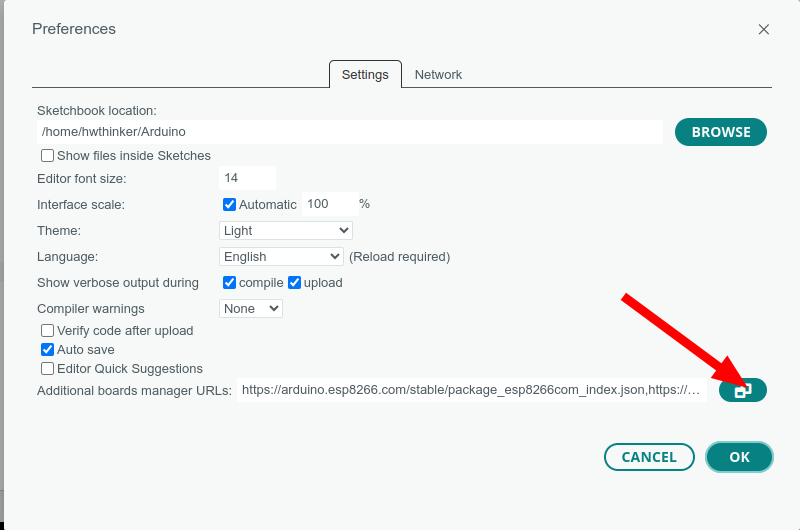
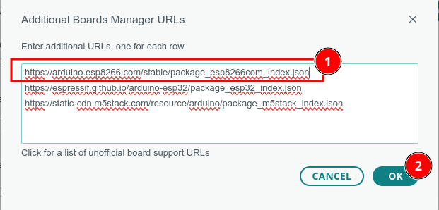
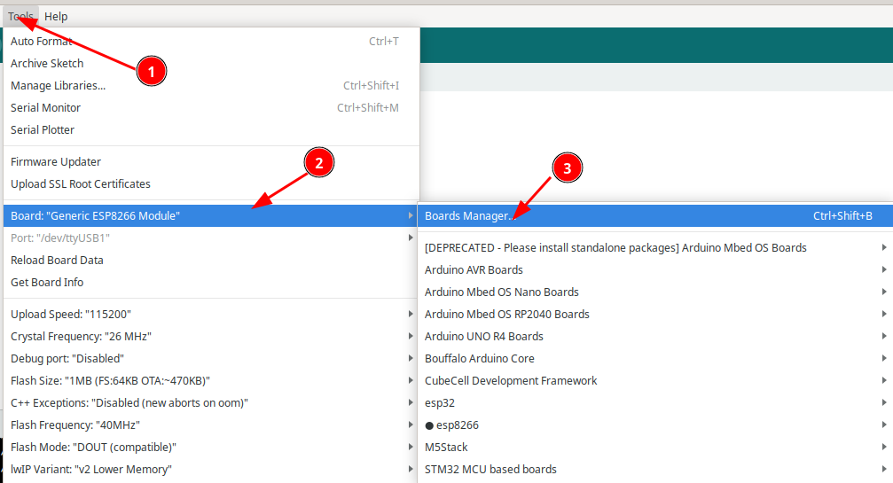
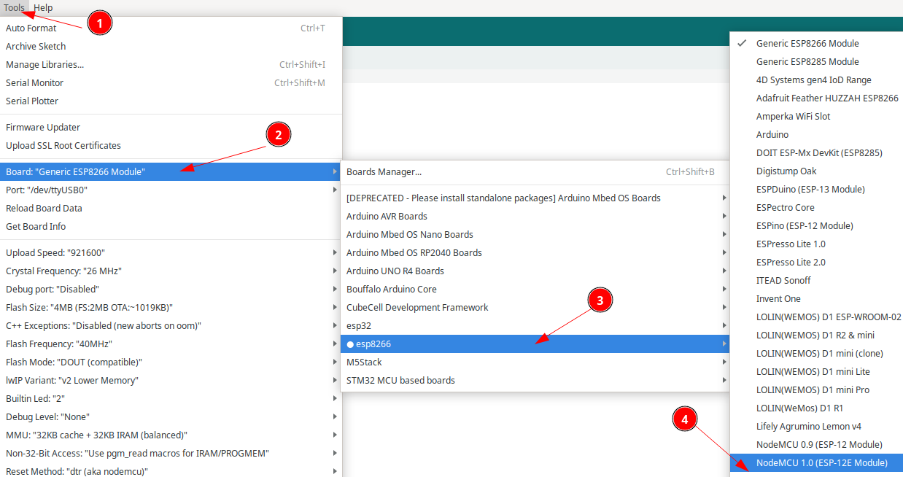
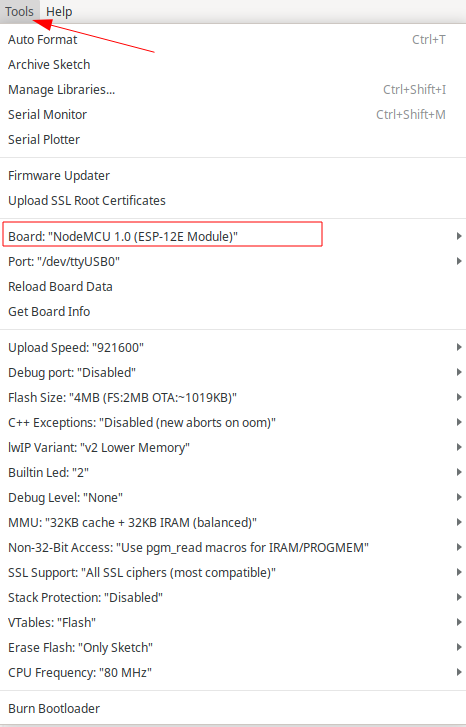

# Modul ESP8266 ESP-12f Relay 4 Channel 


## Cara install plugin Arduino IDE

### Langkah 1: Buka Arduino IDE

1. Buka aplikasi Arduino IDE di komputer Anda. Jika belum ada, unduh dan instal Arduino IDE dari situs resmi Arduino di https://www.arduino.cc/en/software. disarankan menggunakan arduino ide versi 2

### Langkah 2: Tambahkan URL Board Manager untuk ESP8266

2. Di Arduino IDE, buka **File** > **Preferences**.

   

3. Pada bagian  Additional Boards Manager URLs, tambahkan URL berikut:

```
https://arduino.esp8266.com/stable/package_esp8266com_index.json
```

4. Jika sebelumnya Anda sudah memiliki URL lain di sana, pisahkan URL ini dengan tanda koma atau baris baru.



### Langkah 3: Buka Boards Manager

1. Buka **Tools** > **Board** > **Boards Manager**.



2. Di kotak pencarian, ketik **ESP8266**

### Langkah 4: Instal Board ESP8266

1. Temukan **ESP8266 by Espressif Systems** di daftar, kemudian klik **Install**.


2. Tunggu hingga proses instalasi selesai.

### Langkah 5: Pilih Board ESP8266

1. Setelah instalasi selesai, Anda dapat memilih board ESP8266.
2. Buka **Tools** > **Board**, dan gulir ke bawah untuk menemukan berbagai jenis board ESP8266 yang telah diinstal. Pilih board yang sesuai, misalnya **Nodemcu 1.0 (ESP-12E Module)** 



3. hasilnya kurang lebih seperti ini



### Langkah 6: Pilih Port

1. Sambungkan board esp8266 ke komputer Anda menggunakan kabel USB.
2. Di **Tools** > **Port**, pilih port yang sesuai dengan esp8266 Anda.


## Testing Relay

1. **Buat Sketsa Baru**:

   - Buka Arduino IDE, klik **File** → **New** untuk membuat sketsa baru.

2. Ketik Kode 

   ```c++
   #include <Arduino.h>
   
   #define LED_ESP 2
   #define RLY1 16
   #define RLY2 14
   #define RLY3 12
   #define RLY4 13
   
   const int relayPins[] = {RLY1, RLY2, RLY3, RLY4};
   const int numRelays = sizeof(relayPins) / sizeof(relayPins[0]);
   const int delayTime = 1000;  // Waktu delay dalam milidetik
   
   void setup() {
     pinMode(LED_ESP, OUTPUT);
     for (int i = 0; i < numRelays; i++) {
       pinMode(relayPins[i], OUTPUT);
       digitalWrite(relayPins[i], LOW);  // Matikan semua relay pada awal
     }
     digitalWrite(LED_ESP, LOW);  // Matikan LED pada awal
   }
   
   void loop() {
     digitalWrite(LED_ESP, HIGH);  // Nyalakan LED saat RLY1 aktif
     for (int i = 0; i < numRelays; i++) {
       digitalWrite(relayPins[i], HIGH);  // Nyalakan relay
       delay(delayTime);
   
       digitalWrite(relayPins[i], LOW);  // Matikan relay
     }
     digitalWrite(LED_ESP, LOW);  // Matikan LED setelah RLY4 mati
     delay(delayTime);
   }
   
   ```

3. **Simpan Sketsa**:

   - Simpan sketsa dengan nama seperti `testing-relay.ino`.


## Cara download dengan Serial USB biasa


- Pasang serial USB TTL dengan ketentuan: 
  - TX Board-> RX USB Serial (Kabel Putih)
  - RX Board-> TX USB Serial (Kabel Hijau)
  - GND Board-> GND USB Serial (Kabel Hitam)
- Pastikan supply AC220V  dihubungkan 2 pin Terminal block(pin N dan L)
- jumper IO0 ke ground 
- klik (tekan dan lepas) tombol rst dan pastikan  IO0 masih di ground
- Lepas tombol IO0
- Download program dan tunggu sampai selesai
- klik tombol rst untuk run-program (langkah ini penting agar firmware baru dijalankan)
- ulang langkah awal bila melakukan download ulang lagi


## Cara download dengan Serial USB auto Download


- Pasang serial USB TTL dengan ketentuan:
  - RX board -> RX USB Serial  
  - TX board-> TX USB Serial 
  - GND board -> GND USB Serial  
  - IO0 board -> IO# USB Serial 
  - EN board -> EN# USB Serial
- Pastikan supply AC220V  dihubungkan 2 pin Terminal block(pin N dan L)
- Download program dan tunggu sampai selesai

Warning:❗⚠️
Aktifkan daya untuk menghidupkan alat hanya dengan satu jenis sumber daya, bisa 9VDC, 5VDC, atau AC220V. Jangan menghubungkan beberapa sumber daya secara bersamaan, karena akan menyebabkan kerusakan pada alat.

## Troubleshooting

- Jika terjadi kesalahan saat unggah, coba ganti **Upload Speed** di **Tools** → **Upload Speed** menjadi nilai yang lebih rendah, seperti `115200`.
- Pastikan Anda menggunakan kabel USB yang mendukung transfer data, bukan hanya kabel pengisian daya.

> [!NOTE]
> Untuk serial disarankan menggunakan serial auto download
>
> - https://tokopedia.link/Ml3NIixX6Mb atau
> - https://shopee.co.id/product/21375728/27056587756/ 